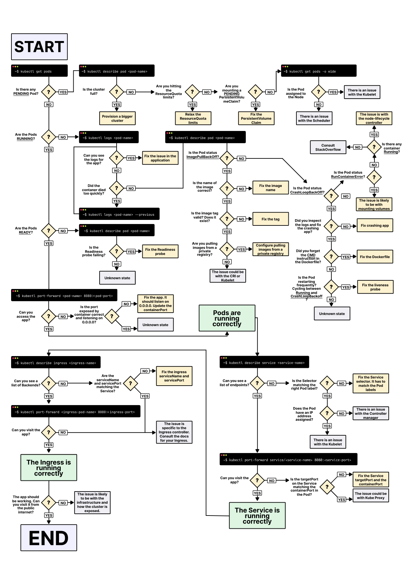

# CrashLoopBackOff

# 100Days Resources
* [Video by Anais Urlichs](https://youtu.be/-ypljeZrSgc)
* Add your blog posts, videos etc. related to the topic here!

# Learning Resources
- [A visual guide on troubleshooting Kubernetes deployments](https://learnk8s.io/troubleshooting-deployments)

# Example Notes

